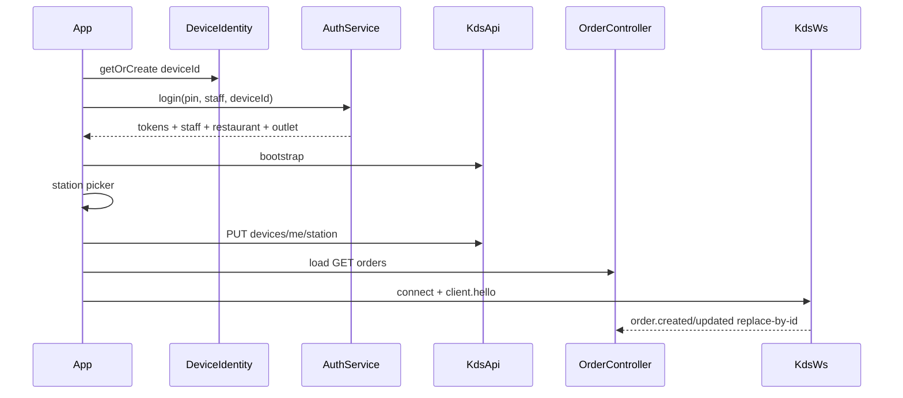

# Backend KDS Integration Plan

## Scope and constraints

- Cut the app over from mock data to the **shipped** KDS backend. This is a substantial integration (models, auth session, REST, WebSocket, conflict recovery, and three new UI behaviors) — review and land it in the incremental build order below, not as one PR.
- **Source of truth:** [`docs/KDS_FRONTEND_INTEGRATION_GUIDE.md`](docs/KDS_FRONTEND_INTEGRATION_GUIDE.md) (what staging actually returns). Historical planning only: [`docs/BACKEND_KDS_INTEGRATION.md`](docs/BACKEND_KDS_INTEGRATION.md) — do not implement against old-spec assumptions that §13 of the guide marks as wrong.
- Follow project rules in [`.cursor/rules/`](.cursor/rules/): lightweight MVC ([`02-architecture.md`](.cursor/rules/02-architecture.md)); handwritten Riverpod, no codegen / no get_it ([`03-riverpod-state-management.md`](.cursor/rules/03-riverpod-state-management.md)); services own I/O; controllers own domain state; views stay dumb.
- **Do not restate** board layout, masonry packing, continuation cards, or column math. Those stay owned by [`PLAN_kds_desktop.md`](PLAN_kds_desktop.md). This plan only notes where new order/item flags must stay **height-neutral** (or require an explicit packer-constant update) so desktop packing contracts are not broken.
- No freezed / json_serializable unless already present — hand-written `fromJson` / `copyWith` on models.
- New runtime deps allowed only as needed for I/O: `http`, `web_socket_channel`, `uuid` (plus existing `shared_preferences`). No DI framework beyond Riverpod.
- Staging base URL: `http://localhost:5088` (REST under `/api/v1/kds/...`); WebSocket URL and heartbeat from bootstrap. Keep the base URL as a configurable constant — not hardcoded deep in widgets.

---

## 1. Model changes required

Diff current models under [`lib/models/`](lib/models/) (also mirrored in old-spec §4 of [`BACKEND_KDS_INTEGRATION.md`](docs/BACKEND_KDS_INTEGRATION.md)) against guide §5–§7 payloads.

### ID formats (opaque — never parse or construct)

| ID | Example shape | Client rule |
|----|---------------|-------------|
| `orderId` | `ord_12345:station_grill` | Opaque. Echo exactly. Never parse or construct. |
| `itemId` | `item_987:station_grill` | Opaque. Echo exactly. Never parse or construct. |
| `sourceOrderId` / `sourceItemId` | `ord_12345` / `item_42` | Display/debug only if needed |
| `stationId` / `productId` | `station_grill` / `prod_100` | From bootstrap / payloads |

### Order — [`lib/models/order_model.dart`](lib/models/order_model.dart)

| Change | Field | Notes |
|--------|-------|--------|
| **Add** | `version` (`int`) | Required for every mutating call’s `expectedVersion` |
| **Add** | `updatedAt` (`DateTime`) | From list / WS / action summaries |
| **Add** | `completedAt` (`DateTime?`) | Null until completed |
| **Add** | `sourceOrderId` (`String`) | Display/debug only — never synthesize `id` from it |
| **Add** | `kotNumber` (`String?`) | Present in list payload; may equal `displayNumber` |
| **Add** | `restaurantId`, `outletId` (`String`) | Echo from server; needed for queries |
| **Extend** | `OrderStatus.cancelled` | Active-board status; **not** Completed-tab |
| Keep | `id`, `displayNumber`, `stationId`, `createdAt`, `type`, `status`, `items`, `tableNumber?`, `customerName?`, `note?` | Unchanged roles |

**Order `status` values from API:** `newOrder` \| `cooking` \| `completed` \| `cancelled`  
**Order `type` values:** `dineIn` \| `takeOut` \| `delivery`

### OrderItem — [`lib/models/order_item_model.dart`](lib/models/order_item_model.dart)

| Change | Field | Notes |
|--------|-------|--------|
| **Add** | `isNew` (`bool`, default `false`) | Late add after cooking started; cleared when item completed |
| **Add** | `isRemoved` (`bool`, default `false`) | Keep visible; never omit from UI |
| **Add** | `isRemovedUnseen` (`bool`, default `false`) | Needs acknowledge; same persist pattern as `isNew` |
| **Add** | `sourceItemId` (`String`) | Display/debug only |
| **Add** | `sortOrder` (`int`) | Preserve server order when rendering |
| Keep | `id`, `productId`, `nameSnapshot`, `quantity`, `modifierText?`, `note?`, `isCompleted` | Unchanged |

### Station — [`lib/models/station_model.dart`](lib/models/station_model.dart)

| Change | Field |
|--------|-------|
| **Add** | `isActive` (`bool`) |

Picker should prefer `isActive == true` stations from bootstrap.

### Product — [`lib/models/product_model.dart`](lib/models/product_model.dart)

| Change | Field |
|--------|-------|
| **Add** | `stationIds` (`List<String>`) |
| **Add** | `isActive` (`bool`) |

Sidebar may later filter by station; v1 can keep existing aggregation but store fields for correctness.

### ProductCategory — [`lib/models/product_category_model.dart`](lib/models/product_category_model.dart)

No structural change required (`id`, `name`, `sortOrder`).

### New session / bootstrap DTOs (models or thin service DTOs)

- `Staff` / session slice: `id`, `name`, `initials`, `roles`
- `Restaurant`, `Outlet`: ids + names
- `BootstrapResult`: `serverTime`, stations, categories, products, `websocket` (`url`, `heartbeatIntervalSeconds`, `reconnectMinDelayMs`, `reconnectMaxDelayMs`)
- `OrdersListResult`: `serverTime`, `stationId`, `syncCursor`, `orders`
- `SyncResult`: `events`, `nextCursor`, `requiresFullReload`
- Shared API error type with `code`, `message`, `details`, optional top-level `order` for `VERSION_CONFLICT`

### Filtering impact (do not restate packing)

[`ordersForCurrentViewProvider`](lib/providers/providers.dart) today treats Cooking as “non-completed”. After `cancelled` exists, Cooking/active must **include** `cancelled` (guide: cancelled stays on the active board). Completed remains `status == completed` only. Packing continues to consume the filtered list as defined in [`PLAN_kds_desktop.md`](PLAN_kds_desktop.md).

---

## 2. New services under `lib/services/`

Plain classes + Riverpod providers in [`lib/providers/providers.dart`](lib/providers/providers.dart). Controllers call services; widgets do not import `http` / `web_socket_channel`.

| Service | File | Responsibility |
|---------|------|----------------|
| **DeviceIdentityService** | `lib/services/device_identity_service.dart` | On first run generate a UUID `deviceId`, persist via `shared_preferences`; return the stable id thereafter. Used on login body, `X-Device-Id`, action bodies, and WS query. |
| **AuthService** / session store | `lib/services/auth_service.dart` (+ small token store helper if needed) | `login` / `refresh`; persist `accessToken`, `refreshToken`, `expiresAt`, staff, restaurant, outlet; clear on logout. No approval polling. No PIN lockout counters. |
| **KdsApiService** | `lib/services/kds_api_service.dart` | Authenticated REST: bootstrap; `GET /orders`; start / complete / rollback; item PATCH (toggle-complete and `acknowledgeRemoved`); `PUT /devices/me/station`; `GET /sync`. Every non-auth call sends `Authorization`, `X-Device-Id`, and a fresh `X-Request-Id`. Replaces [`MockOrdersService`](lib/services/mock_orders_service.dart) as the order source (keep mock behind a flag during cutover, or delete after — prefer a staging/env flag). |
| **KdsWebSocketService** | `lib/services/kds_websocket_service.dart` | Connect with bootstrap URL + query (`restaurantId`, `outletId`, `stationId`, `deviceId`, `access_token`); send `client.hello` (+ `lastCursor`); answer `ping` → `pong` with the same `messageId`; dispatch `order.created` / `order.updated` as full-order replace callbacks; reconnect with bootstrap min/max backoff; on `syncRequired` or gap, call sync catch-up via the API. |

**Suggested shared helper (not a framework):** thin `KdsHttpClient` in services that attaches required headers and maps the standard error envelope (including 409 bodies with a full `order`).

Login and refresh do **not** require auth / device / request-id headers. Every other REST call under `/api/v1/kds/*` does.

### Controller wiring

- Extend [`AuthController`](lib/controllers/auth_controller.dart) to call `AuthService` with real `staffId` / `pin` / `restaurantId` / `outletId` / `deviceId` (login UI must gain real staff ids — not display names only).
- Extend [`OrderController`](lib/controllers/order_controller.dart) to call `KdsApiService` for mutations, apply WS replace-by-id, track `syncCursor`, and handle 409 paths (below).
- Bootstrap catalog → replace mock-backed `stationsProvider` / `productsProvider` / `productCategoriesProvider` with session/bootstrap state.

---

## 3. Idempotency + versioning strategy

### Where keys are generated

- Generate a new UUID `idempotencyKey` **per distinct user action** inside `OrderController` methods (`startOrder`, `completeOrder`, `rollbackOrder`, `toggleItemCompleted`, `acknowledgeRemovedItem`) at the moment the user initiates the action.
- On **transport retry** of the same in-flight action, resend the **same** key + same body.
- After a resolved `VERSION_CONFLICT` (or the user abandons then retries later), generate a **new** key.
- Prefer always sending a real UUID (empty / all-zero keys are ignored by the server).

### `expectedVersion`

- Always send `order.version` from the local canonical copy at action start.
- After every successful action response, WS event, sync event, or conflict adoption: replace the local order (full object when available). Prefer full replace when a full order is present; for action summaries that only return status/version/`updatedAt`/`completedAt`, merge those fields carefully onto the existing ticket.

### Recovery: `409 VERSION_CONFLICT`

1. Parse the top-level `order` from the error body (full state).
2. Replace the local order by `id` in `OrderController`.
3. Surface a non-blocking message (“Order updated elsewhere”) so the user can decide to retry.
4. If they retry, use the new local `version` and a **new** idempotency key.

### Recovery: `409 INVALID_TRANSITION`

- Different meaning: a state-machine rejection, **not** a version race.
- Adopt `details.currentStatus` if a full order is not present — refresh/replace that order from list/WS if needed.
- Do **not** auto-retry the same transition; show why (e.g. cannot complete from `newOrder`).
- Footer / item actions should re-derive availability from the updated status.

### Already-applied start

Guide: start when the order is already `cooking` may return success with `alreadyApplied: true`. Treat as success; sync local state to the returned summary; no version bump assumed.

### Completing all items

Marking every item `isCompleted: true` does **not** complete the order. The operator must still call `POST .../complete` with a valid `expectedVersion`. Matches both the guide and the desktop plan.

---

## 4. Three new domain/UI behaviors — CONFIRMED

Confirmed for step 9 UI. Do not invent packing/layout rules here — only height-neutral visual treatments unless an explicit packer-constant change is approved (see [`PLAN_kds_desktop.md`](PLAN_kds_desktop.md) packing-safety constraint).

### 4a. Cancelled orders — CONFIRMED

**Must:** stay visible on the active board; arrive as `order.updated` with `status: "cancelled"`; never disappear via `order.removed` (that event is not emitted).

**Confirmed treatment:**
- Keep the ticket on the Cooking/active board.
- Distinct muted Cancelled header token (semantic theme token — not urgency red); visually de-prioritize (reduced emphasis / muted chrome) without changing reserved packing heights.
- **Disable** Start / Complete / item double-tap-complete; **still allow** acknowledge-removed on removed lines.
- Card stays visible.
- **Sort:** cancelled tickets stay chronological among active orders — do **not** sort them after non-cancelled ones. Matches the chronological packing order locked in [`PLAN_kds_desktop.md`](PLAN_kds_desktop.md) (staff read oldest first; cancelled tickets are no exception).

### 4b. `isNew` (late-added) items — CONFIRMED

**Must:** highlight until the kitchen acts; clear when that item is marked completed (server clears `isNew`); not cleared by timer, reconnect, or passive delivery.

**Confirmed treatment:** `OrderItemRow` gets a height-neutral highlight (left accent bar or background tint via theme token) while `isNew == true`; clears automatically when that item is marked completed (local replace from PATCH/WS). No timer. Double-tap-complete path unchanged for non-removed cooking items. Packing must remain height-stable (same rule as strikethrough in the desktop plan).

### 4c. `isRemoved` / `isRemovedUnseen` items — CONFIRMED

**Must:** keep removed lines in `items[]` with `isRemoved: true`; highlight while `isRemovedUnseen: true` (same persist pattern as `isNew`); acknowledge only via item PATCH with `acknowledgeRemoved: true` (not via complete toggle — removed lines cannot be completed). This is a **new interaction**, distinct from double-tap-complete.

**Confirmed treatment:**
- Render removed lines distinctly from both normal and completed (e.g. muted “Removed” label + different decoration — not the same as done strikethrough alone).
- While `isRemovedUnseen`, keep highlight parallel to `isNew`.
- Acknowledge via an **explicit small button** on the row (not double-tap, not single-tap on the whole row). Button copy: **"Got it"** (not “Ack”).
- Button calls `acknowledgeRemoved` PATCH only.
- Acknowledged-but-still-removed lines stay muted/removed-styled but **drop** the `isRemovedUnseen` highlight once acknowledged.

---

## 5. Auth / login screen changes

**Today:** fake PIN in [`AuthController`](lib/controllers/auth_controller.dart) → [`KitchenDisplayScreen`](lib/views/kitchen_display/kitchen_display_screen.dart); station picker only on the KDS top bar; no tokens or device id.

**Target first-run flow** (guide §3.5):

1. `DeviceIdentityService.getOrCreate()` on app start — persist a stable `deviceId`.
2. Login with `restaurantId` + `outletId` + `staffId` + `pin` + `deviceId` (staging outlet: `outlet_main`; restaurant/staff ids from config or a selectable staff list with real ids).
3. Store `accessToken`, `refreshToken`, `expiresAt`, staff, restaurant, outlet; map staff initials into the existing avatar path.
4. Call **bootstrap**; populate stations / products / categories + WS config.
5. Station picker (post-login gate and/or keep the top-bar selector). On first choice / change, call `PUT /devices/me/station` as a preferred default only — **not** an access restriction. Orders APIs and WS still take an explicit `stationId` for the station currently viewed.
6. `OrderController` loads `GET /orders?status=active` (and completed as needed for the Completed tab).
7. Open WebSocket for the selected station; send `client.hello` with last `syncCursor`.

**Explicitly do not build:**

- Device-approval / “waiting for approval” / pending polling UI.
- PIN lockout countdown / “try again in X minutes” UI.
- Richer role-matrix UI (login returns `kds_operator` when allowed).

**Login error handling for v1:**

| Code | Handling |
|------|----------|
| `INVALID_PIN` | Show wrong-PIN message; clear or keep PIN per existing UX |
| `STAFF_NOT_ALLOWED` | Staff cannot use KDS |
| `DEVICE_NOT_ALLOWED` | Kill-switch / blocked message — **not** “awaiting approval” |
| `UNAUTHORIZED` | Attempt refresh; if refresh fails, return to login |

Access token lifetime (staging): ~30 minutes. Refresh token: ~7 days. Refresh does not rotate the refresh token.

---

## 6. Incremental build order

Each step is reviewable before the next starts:

1. **Models + JSON parsing + unit tests** — new/changed fields; opaque id fixtures; `OrderStatus.cancelled`; item flags (`isNew`, `isRemoved`, `isRemovedUnseen`, `sortOrder`, `sourceItemId`).
2. **DeviceIdentityService + AuthService + token persistence + AuthController cutover** — login/refresh against staging; no approval/lockout UI; tests with mocked HTTP.
3. **KdsApiService bootstrap + catalog providers** — replace mock stations/products; station picker wired to bootstrap; optional `PUT /devices/me/station`.
4. **Replace mock order list** — `GET /orders` active/completed into `OrderController`; preserve existing view/provider contracts from [`PLAN_kds_desktop.md`](PLAN_kds_desktop.md).
5. **Wire start / complete / rollback** — idempotency keys + `expectedVersion`; handle `alreadyApplied`, `VERSION_CONFLICT`, `INVALID_TRANSITION`.
6. **Item PATCH** — toggle complete (cooking only, non-removed); acknowledge-removed path (API wired; UI chrome can be minimal/stub until step 9).
7. **WebSocket** — connect, hello, ping/pong, `order.created` / `order.updated` full replace-by-id; persist cursor. Do not handle `order.removed`.
8. **Reconnect + sync-since-cursor** — backoff from bootstrap; `syncRequired` / gap → `GET /sync`; `requiresFullReload` → full `GET /orders` and reset cursor from the list response.
9. **Cancelled / isNew / isRemoved UI treatments** — use confirmed §4a–4c decisions; keep packing height contracts from the desktop plan.

---

## 7. Explicit non-goals for v1

Do **not** implement anything that [guide §13](docs/KDS_FRONTEND_INTEGRATION_GUIDE.md) says the shipped system does not do — even if [`BACKEND_KDS_INTEGRATION.md`](docs/BACKEND_KDS_INTEGRATION.md) described it:

| Old-spec assumption ([`BACKEND_KDS_INTEGRATION.md`](docs/BACKEND_KDS_INTEGRATION.md)) | Shipped reality ([guide §13](docs/KDS_FRONTEND_INTEGRATION_GUIDE.md)) |
|-----|------|
| Device approval / pending polling | Auto-register on first successful login; no approval UI |
| PIN lockout after N failures | Always `INVALID_PIN`; no lockout UI |
| Device station as a hard filter / restriction | Preferred default only (`PUT /devices/me/station`) |
| `DEVICE_NOT_ALLOWED` = awaiting approval | Kill-switch / blocked only (`IsAllowed = 0` or missing device on refresh) |
| `order.removed` erase-from-board (especially for cancels) | **Not emitted**; cancels arrive as `order.updated` with `status: cancelled` |
| Printer-based routing sync | Bootstrap stations/products only; MSIRms KDS Management owns routing |
| Silently drop / omit removed lines | Lines stay in payloads with `isRemoved: true` |
| Auto-complete order when all items done | Still requires explicit `POST .../complete` |
| Production URL / voided-heavy board flows | Production URL TBD; guide tickets use `cancelled`, not a separate voided erase path |
| Rich role matrix beyond `kds_operator` | Ignore for UI |

Also non-goals for this integration track:

- Re-litigating masonry / packing / continuation logic (see [`PLAN_kds_desktop.md`](PLAN_kds_desktop.md)).
- Adding DI beyond Riverpod (no get_it).
- Building printer sync tooling or device-approval admin UI.
- Listening for or implementing handlers for `order.removed`.

---

## Confirmed

**Wire against the guide:**

- Guide is source of truth; old spec is historical.
- Opaque `orderId` / `itemId`; full-order replace on WS/sync; no deep-merge of item lists.
- Device auto-registration; no approval or PIN-lockout UI.
- Idempotency per user action; distinct recovery for `VERSION_CONFLICT` vs `INVALID_TRANSITION`.
- Build order is incremental (models/auth → bootstrap → list → mutations → items → WS → sync → UI flags last).
- Board/packing ownership stays in [`PLAN_kds_desktop.md`](PLAN_kds_desktop.md); new flags must not break height-neutral packing without an explicit decision.

**§4 UI behaviors (unblocks step 9):**

- **4a** Cancelled: muted Cancelled header; Start/Complete/double-tap-complete disabled; acknowledge-removed allowed; card stays visible; chronological among active (do not sort after non-cancelled).
- **4b** `isNew`: height-neutral highlight (left accent / tint); clears on item completed; no timer.
- **4c** Removed: distinct muted “Removed” styling; `isRemovedUnseen` highlight until acknowledged; explicit **"Got it"** button (not double-tap / row-tap); after ack, stay muted/removed without the unseen highlight.
