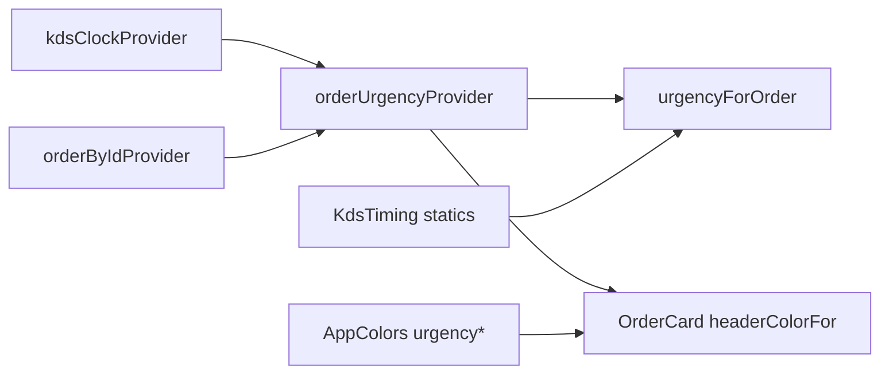
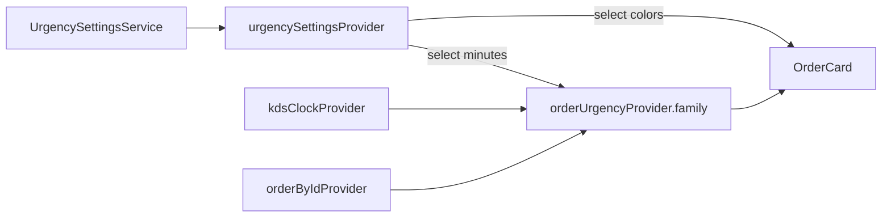

# Configurable Order Urgency Settings

## Scope and constraints

- Make warning/critical **time thresholds** and their **header colors** editable from Settings → Order Timing, and persist them on-device.
- Follow project rules in [`.cursor/rules/`](.cursor/rules/): simple over clever ([`01-project-overview.md`](.cursor/rules/01-project-overview.md)); Controller = Notifier classes in `controllers/` ([`02-architecture.md`](.cursor/rules/02-architecture.md)); derived-data / `.family`/`select` discipline ([`03-riverpod-state-management.md`](.cursor/rules/03-riverpod-state-management.md)); no silent new deps ([`06-cursor-coding-conventions.md`](.cursor/rules/06-cursor-coding-conventions.md)).
- Mirror persistence after [`ThemePreferenceService`](lib/services/theme_preference_service.dart) + [`main.dart`](lib/main.dart) `ProviderScope` override — do not invent a second persistence style.
- **No color-picker package.** Use a fixed preset-swatch UI (see below). No codegen / freezed.
- Do not change WebSocket, order mutations, packing, or Notifications. Do not restyle unrelated Settings sections beyond filling Order Timing.

---

## What exists today

| Piece | Role |
|-------|------|
| [`lib/core/constants/kds_timing.dart`](lib/core/constants/kds_timing.dart) | Static `warningThreshold` (1m), `criticalThreshold` (2m), `clockTickInterval` (3s) |
| [`lib/core/utils/order_urgency.dart`](lib/core/utils/order_urgency.dart) | Pure `urgencyForOrder(order, now)` reads those statics |
| [`orderUrgencyProvider`](lib/providers/providers.dart) | `Provider.family` watches `orderByIdProvider` + `kdsClockProvider`, calls `urgencyForOrder` |
| [`headerColorFor`](lib/views/kitchen_display/widgets/order_card.dart) | Maps `OrderUrgency` → `AppColors.urgencyWarning` / `urgencyCritical` |
| [`ThemePreferenceService`](lib/services/theme_preference_service.dart) | SharedPreferences `load`/`save`; bootstrap override in `main.dart` |
| Settings → Order Timing | Empty [`_SettingsSection`](lib/views/settings/settings_screen.dart) placeholder |



Target: insert one watched settings source; keep urgency **derived**, not duplicated onto `Order`.

---

## Confirmed design decisions (open questions a–e)

### a. Data shape — **one grouped model + one Notifier + one prefs key**

**Decision:** `UrgencySettings` (warning minutes, critical minutes, warning color ARGB, critical color ARGB) owned by a single `NotifierProvider`, persisted as one JSON string under one SharedPreferences key (`urgency_settings`).

**Why this balance:**
- Theme already uses **one concept → one key → one provider**, not four micro-keys.
- These four values are one kitchen policy; splitting into four `StateProvider`s is provider soup with no validation owner.
- A full Notifier (not bare `StateProvider`) is justified: validation, reset-to-defaults, and `save()` after updates — more than a single primitive toggle like `themeModeProvider`.
- Still no premature repository/use-case layer: plain model + service + notifier, same weight as auth/theme.

**Placement:** `UrgencySettingsController` lives in [`lib/controllers/urgency_settings_controller.dart`](lib/controllers/urgency_settings_controller.dart) — same as `AuthController` / `OrderController` per [`02-architecture.md`](.cursor/rules/02-architecture.md) (“Controller = Notifier classes in `controllers/`”). Provider registration stays in [`lib/providers/providers.dart`](lib/providers/providers.dart); the Notifier class is **not** colocated there.

Defaults = today’s `KdsTiming` minutes + `AppColors.urgencyWarning` / `urgencyCritical`. Keep those constants as **default sources**; runtime path reads the notifier.

### b. Validation — **hard invariants in the Notifier (and normalize on load)**

**Decision (always enforced):**
1. Minutes are integers, **minimum 1**, **maximum 120** (not optional).
2. Always enforce **`criticalMinutes > warningMinutes`**.
3. On stepper press: if increasing warning would violate (2), also bump critical to `warning + 1` (still ≤ 120). If decreasing critical would violate (2), clamp critical to `warning + 1` (or no-op the decrement). Same idea when applying a reset.

No toast/snackbar required for v1 — the controls simply refuse illegal states. Matches golden rule #1. Corrupt or unparseable prefs → **defaults** (not a half-applied board policy).

### c. Reset to defaults — **yes**

**Decision:** Include a **Reset to defaults** control in Order Timing. Shared kitchen tablet + wrong thresholds/colors affect every viewer. Pattern: secondary text/outlined button → short `AlertDialog` (same confirmation style as logout) → restore defaults + persist.

### d. Duration UI — **minute steppers (+/−), not text fields**

**Decision:** Large touch steppers (±1 minute) with the current value displayed between buttons. Touch-first tablet ([`01-project-overview.md`](.cursor/rules/01-project-overview.md)); steppers encode the validation rules above without a keyboard. Do **not** reuse [`numeric_keypad.dart`](lib/views/login/widgets/numeric_keypad.dart) — that is PIN auth chrome, wrong affordance for 1–120 minute policy.

### e. Live vs new-orders-only — **immediate / live for all visible cards**

**Decision:** Confirm live. Urgency is already derived from `createdAt` + clock; settings are just another input to that derivation. When thresholds/colors change, every mounted `orderUrgencyProvider(id)` / card that watches color settings recomputes — no resync, no “only new tickets.” Same mental model as today’s 3s clock tick.

---

## Pure function vs Riverpod

**Keep [`urgencyForOrder`](lib/core/utils/order_urgency.dart) pure.** Change signature to take thresholds explicitly, e.g.:

```dart
OrderUrgency urgencyForOrder(
  Order order,
  DateTime now, {
  required Duration warningThreshold,
  required Duration criticalThreshold,
})
```

[`orderUrgencyProvider`](lib/providers/providers.dart) watches settings (via `select` on the two minute fields), builds `Duration`s, and calls the pure function. **No `ref` inside `core/utils`.** Unit tests pass thresholds without ProviderScope.

---

## Derived-data consistency (Riverpod)



- **Stored:** only `UrgencySettings` in the notifier (+ prefs).
- **Derived:** `OrderUrgency` stays a `Provider.family` — never written onto `Order`, never a second cached map of urgencies.
- Changing settings invalidates watchers automatically; no manual board refresh.
- Rebuild discipline: `orderUrgencyProvider` `select`s minutes only; `OrderCard` / `headerColorFor` takes warning/critical `Color`s from a `select` on the color fields so a color-only edit does not re-derive urgency unnecessarily.

Update [`headerColorFor`](lib/views/kitchen_display/widgets/order_card.dart) to accept `warningColor` / `criticalColor` parameters (defaults can remain `AppColors.*` for call-site clarity). Status base colors stay on `AppColors` / brightness as today. Cancelled still never uses urgency colors.

---

## Persistence shape (ThemePreferenceService twin)

New [`lib/services/urgency_settings_service.dart`](lib/services/urgency_settings_service.dart):
- Optional `SharedPreferences` injection for tests (same pattern as [`DeviceIdentityService`](lib/services/device_identity_service.dart))
- `Future<UrgencySettings> load()` — missing/corrupt → defaults
- `Future<void> save(UrgencySettings settings)` — encode JSON string
- Single key `urgency_settings`; store color as `int` ARGB, minutes as `int`

Bootstrap in [`main.dart`](lib/main.dart): `await service.load()` then `urgencySettingsProvider.overrideWith(...)` alongside the existing theme override.

`UrgencySettingsController` methods (e.g. `setWarningMinutes`, `setCriticalMinutes`, `setWarningColor`, `setCriticalColor`, `resetToDefaults`) update state then `await service.save(...)`. Same fire-and-persist pattern as [`DarkModeToggle`](lib/views/kitchen_display/widgets/dark_mode_toggle.dart).

---

## Colors: preset swatches (no new dependency)

**Choice:** fixed palettes in [`lib/core/theme/urgency_color_presets.dart`](lib/core/theme/urgency_color_presets.dart) (e.g. 6–8 swatches for warning-appropriate ambers/oranges, 6–8 for critical reds/deep oranges), rendered as tappable circles/chips. Defaults included in both lists.

**Header-text readability constraint:** swatches must stay readable behind [`AppColors.onStatusHeader`](lib/core/theme/app_colors.dart) (white) overlay text in the status header band. **Do not include very light/pale colors** (cream, light yellow, pastel pink, near-white) that would fail contrast against white order # / time text. Prefer mid-to-deep saturated warning and critical hues; document this constraint in a short comment on the presets file.

**Why not a picker package (golden rule #1 / conventions):** kitchen staff need high-contrast board colors, not arbitrary RGB; a full picker adds dependency + tablet precision pain + a11y surface. Presets are enough and stay on existing theme tokens.

**Flag for human (not adding unless asked):** if product later wants free-form brand colors, revisit `flutter_colorpicker` (or similar) as an **explicit** dependency decision — out of scope for this plan.

Logout / semantic `AppColors.urgencyCritical` usage in Settings Account stays the **fixed** destructive token — do **not** couple it to the board critical color (logout red ≠ board urgency policy).

---

## Settings UI (Order Timing section)

Fill the existing placeholder in [`settings_screen.dart`](lib/views/settings/settings_screen.dart) (extract a small private/local widget if `build` grows past ~50–60 lines per conventions):

1. **Warning after** — stepper (minutes, 1–120)
2. **Critical after** — stepper (minutes, 1–120), always > warning
3. **Warning color** — horizontal wrap of preset swatches; selected ring
4. **Critical color** — same
5. **Reset to defaults** — confirm dialog → defaults + save

Theme-reactive body colors (existing Settings pattern); steppers/swatches use `colorScheme` + fixed semantic swatch colors. AppBar remains always-dark chrome.

Prefer private widgets in the same file first; optional `lib/views/settings/widgets/` only if the section is large.

---

## File-by-file touch list

| File | Change |
|------|--------|
| **New** [`lib/models/urgency_settings.dart`](lib/models/urgency_settings.dart) | Immutable settings model + `defaults` + clamp helpers + `copyWith` + JSON encode/decode |
| **New** [`lib/services/urgency_settings_service.dart`](lib/services/urgency_settings_service.dart) | SharedPreferences load/save (theme twin; injectable prefs for tests) |
| **New** [`lib/controllers/urgency_settings_controller.dart`](lib/controllers/urgency_settings_controller.dart) | Notifier with validated setters + reset; **not** colocated in providers |
| [`lib/core/constants/kds_timing.dart`](lib/core/constants/kds_timing.dart) | Keep `clockTickInterval`; keep threshold constants as **defaults** (document that runtime reads settings) |
| [`lib/core/utils/order_urgency.dart`](lib/core/utils/order_urgency.dart) | Add required threshold params; stop reading statics internally |
| [`lib/providers/providers.dart`](lib/providers/providers.dart) | Register service + settings provider; wire `orderUrgencyProvider` to watch settings minutes |
| [`lib/main.dart`](lib/main.dart) | Load settings; override provider at startup |
| [`lib/views/kitchen_display/widgets/order_card.dart`](lib/views/kitchen_display/widgets/order_card.dart) | Pass configured colors into `headerColorFor`; watch settings colors |
| [`lib/views/settings/settings_screen.dart`](lib/views/settings/settings_screen.dart) | Implement Order Timing UI |
| **New** [`lib/core/theme/urgency_color_presets.dart`](lib/core/theme/urgency_color_presets.dart) | Fixed swatch lists readable under white header text — no new package |
| **New** `test/models/urgency_settings_test.dart` / `test/services/urgency_settings_service_test.dart` | Defaults, JSON round-trip, corrupt prefs → defaults, clamp/normalize |
| **New** `test/core/utils/order_urgency_test.dart` | Pure function with injected thresholds (later build step) |
| **New** `test/controllers/urgency_settings_controller_test.dart` | Validation + reset (later build step) |

No changes to: `order_controller.dart`, WebSocket, packing, `ThemePreferenceService` internals (only parallel pattern), Notifications section.

---

## Incremental build order

1. **Model + service + unit tests** — `UrgencySettings`, `UrgencySettingsService`, corrupt/missing prefs → defaults, JSON round-trip. Do **not** wire into `order_urgency.dart` / providers / cards / Settings UI yet.
2. **Controller + main override + pure `urgencyForOrder` params + `orderUrgencyProvider` watch** — board uses persisted thresholds; colors may still use `AppColors` defaults until step 3.
3. **`headerColorFor` / `OrderCard` consume configured colors.**
4. **Settings Order Timing UI** (steppers, header-safe swatches, reset + confirm).
5. **`fvm flutter analyze` + `fvm flutter test`.**

---

## Explicit non-goals

- Color-picker package / free-form hex entry
- Per-station or per-staff urgency policies (device-global only)
- Syncing settings to backend / across tablets
- Changing `clockTickInterval` from Settings
- Coupling Account logout red to board critical color
- Notifications section work
- Pale/light swatches that fail contrast against white header text

---

## Confirmed summary

- One `UrgencySettings` model + one prefs JSON key; ThemePreferenceService-shaped persistence.
- `UrgencySettingsController` in `lib/controllers/` (architecture rule); providers only register it.
- `urgencyForOrder` stays pure with explicit thresholds; provider supplies them (derived-data pattern).
- Validation: **min 1 / max 120** minutes, **critical > warning**, enforced in setters/steppers and normalized on load.
- Reset to defaults with confirmation.
- Touch steppers for minutes; preset swatches for colors (readable under `onStatusHeader`); **no new dependency**.
- Changes apply **live** to all visible cards via normal Riverpod invalidation.
