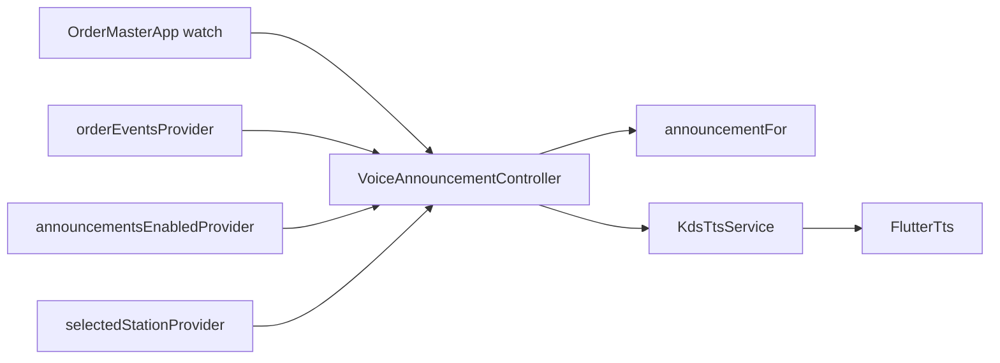

# Voice announcements (flutter_tts)

## Scope and constraints

- Consume the existing [`orderEventsProvider`](lib/controllers/order_controller.dart) stream and speak chef-facing sentences. Fill Settings → Notifications with a persisted mute toggle (and a test speak).
- Follow project rules in [`.cursor/rules/`](.cursor/rules/): simple over clever ([`01-project-overview.md`](.cursor/rules/01-project-overview.md)); TTS I/O in `services/`, policy in a Notifier, templates in `core/utils/` ([`02-architecture.md`](.cursor/rules/02-architecture.md)); keep the listener alive from the app root, not a screen ([`03-riverpod-state-management.md`](.cursor/rules/03-riverpod-state-management.md)); one approved new dep and document every platform file ([`06-cursor-coding-conventions.md`](.cursor/rules/06-cursor-coding-conventions.md)).
- Do **not** re-litigate emit vs self-action / WS-echo suppression — that is done in [`PLAN_order_events.md`](PLAN_order_events.md) (if that file is not at repo root yet, the Cursor plan is the source).

**Approved dependency:** `flutter_tts: ^4.2.5` (pub.dev, checked 2026-08-14). Platforms listed by the package: **Android, iOS, macOS, Web, Windows**. **Not Linux** — do not claim Linux support.

---

## Platform setup (not just pubspec)

Read of [pub.dev/packages/flutter_tts](https://pub.dev/packages/flutter_tts) (4.2.5):

| Platform | File | Change |
|----------|------|--------|
| **Android (required)** | [`android/app/src/main/AndroidManifest.xml`](android/app/src/main/AndroidManifest.xml) | **Required for targetSdk 30+.** Add a `TTS_SERVICE` query **inside the existing `<queries>` block** (do not replace the Flutter `PROCESS_TEXT` query): `<intent><action android:name="android.intent.action.TTS_SERVICE" /></intent>` |
| Android (docs say minSdk 21) | [`android/app/build.gradle.kts`](android/app/build.gradle.kts) | Already `minSdk = flutter.minSdkVersion` (Flutter 3.44 is ≥ 21). **Do not lower minSdk.** |
| Android (docs say Kotlin 1.9.10) | [`android/settings.gradle.kts`](android/settings.gradle.kts) | Already `org.jetbrains.kotlin.android` **2.3.20**. **Do not downgrade.** |
| iOS | [`ios/Runner/Info.plist`](ios/Runner/Info.plist) | **No TTS-specific keys** in the plugin README for speak-in-foreground. Optional **runtime** `setSharedInstance` / `setIosAudioCategory(ambient, mixWithOthers)` in the Dart service so kitchen audio is not hijacked — not a plist change. |
| macOS | entitlements / Info.plist | README only requires **OSX 10.15**; this repo already has `MACOSX_DEPLOYMENT_TARGET = 10.15`. **No entitlement/plist change** for foreground TTS. |
| Windows / Web | — | **No extra config files** in the README. |
| Linux | — | **Unsupported** by the plugin. Guard `speak` with try/catch so a Linux build does not crash. |

Debug/profile Android manifests do not need a duplicate `<queries>` unless they override the main one (they do not today).

---

## What exists today

| Piece | Role |
|-------|------|
| [`KdsOrderEvent`](lib/models/kds_order_event.dart) | 7 kinds + display/item/type fields. **No `stationId` today.** |
| [`orderEventsProvider`](lib/controllers/order_controller.dart) | Broadcast `StreamProvider`; lazy until watched |
| [`selectedStationProvider`](lib/providers/kds_backend_providers.dart) | This device’s station |
| [`ThemePreferenceService`](lib/services/theme_preference_service.dart) + [`themeModeProvider`](lib/providers/providers.dart) + [`DarkModeToggle`](lib/views/kitchen_display/widgets/dark_mode_toggle.dart) | Simplest persisted boolean/enum: `StateProvider` + service `save` on toggle; bootstrap override in [`main.dart`](lib/main.dart) |
| Settings → Notifications | Empty [`_SettingsSection(title: 'Notifications')`](lib/views/settings/settings_screen.dart) |
| [`OrderMasterApp`](lib/app.dart) | Root `ConsumerWidget`; currently only watches `themeModeProvider` |
| Spoken type names on the board | UI uses “Dine-In” / “Take-Out” / “Delivery”; the original ask used **“table order” / “takeaway”** for speech |



---

## Confirmed design decisions (open questions a–h)

### a. Listener lifecycle — **eager Notifier watched from `OrderMasterApp`**

**Decision:** New `VoiceAnnouncementController` (`Notifier<void>` or a tiny status if tests need it). In `build()`:

- `ref.listen(orderEventsProvider, …)` so the stream subscription is owned by this provider (not by Kitchen Display).
- Read mute + `selectedStationProvider` (watch/select) for enqueue filters.

**Keep it alive:** `OrderMasterApp.build` does `ref.watch(voiceAnnouncementProvider);` (ignore the value). `OrderMasterApp` is always mounted (login, board, settings). Hand-written `NotifierProvider` is **not** `autoDispose`, so it is not disposed when Settings replaces the board.

**Why not listen only on `KitchenDisplayScreen`:** opening Settings unmounts that listen and **silently drops** events — the exact Riverpod lazy-disposal failure this question is about.

**Why not `ref.listen` in `main`:** no `WidgetRef` until the tree exists; the app-root watch is the existing Riverpod idiom.

Login screen: the listener can run; almost no events until orders exist. Harmless.

### b. Sentence templates — **pure `announcementFor` in `core/utils/`**

**Decision:** [`lib/core/utils/order_announcement.dart`](lib/core/utils/order_announcement.dart):

```dart
String spokenOrderType(OrderType type) { ... }
String announcementFor(KdsOrderEvent event)
```

No `Ref`. Table clause: if `tableNumber` is null/empty, omit it entirely (never “table null”). Item name fallback: `"An item"`.

Spoken types (match the original ask, not enum names):

- `dineIn` → `"table order"`
- `takeOut` → `"takeaway"`
- `delivery` → `"delivery"`

**Exact templates:**

1. **newOrder** — `New order {displayNumber}{table}.`  
   e.g. `New order 2, table 3.` / `New order 2.`
2. **cancelled** — `Order {displayNumber} cancelled{table}.`
3. **itemAdded** — `{itemName} added to order {displayNumber}{table}.`
4. **itemRemoved** — `{itemName} removed from order {displayNumber}{table}.`  
   e.g. `Orange juice removed from order 2, table 3.`
5. **itemQuantityChanged** — `{itemName} on order {displayNumber} changed from {oldQuantity} to {newQuantity}{table}.`
6. **orderTypeChanged** — `Order {displayNumber} changed from {previousSpoken} to {nextSpoken}{table}.`  
   e.g. `Order 2 changed from table order to takeaway.`
7. **genericUpdate** — `Order {displayNumber} updated{table}.`

`{table}` = `", table {tableNumber}"` or `""`.

Burst summary (not a kind): `"{n} orders updated."` (use `1 order updated` / `N orders updated`).

### c. Station scoping — **current station only; finish already-queued**

**Agree.** Announcements are for *this* board. Other stations are noise.

**Implementation need:** add **`stationId`** to [`KdsOrderEvent`](lib/models/kds_order_event.dart) as a **non-nullable `String`**, copied in `diffOrderEvents` from `next.stationId`. `Order.stationId` is already non-nullable (original station-routing design) — do **not** introduce `String?` or extra null-handling. Looking up `orderByIdProvider` at listen time is racy (`_emitOrderEvents` currently fires **before** `state =`). Do not rely on that.

**Enqueue filter:** skip unless `event.stationId == ref.read(selectedStationProvider)`.  
**Station switch:** do **not** `stop()` the TTS engine; already-queued utterances finish. Only new events use the new station.

### d. Flood control — **2s / 4 events → summary; max 3 pending**

**Decision (specific numbers):**

1. **Burst window:** 2 seconds. If **≥ 4** events (after station + mute filters) arrive with timestamps spanning ≤ 2s, **do not speak each**. Speak one summary: `"{uniqueOrderIdCount} orders updated."`
2. **Pending cap:** at most **3** utterances waiting (not counting the one currently speaking). If a 4th would enqueue: **drop the extras** and enqueue a single overflow line (`"More order updates."`) instead of growing the native queue.
3. Collapse is **consumer-side only** (as punted from order-events). Detection layer stays dumb.

Extract burst/cap policy as a **pure helper** in [`lib/core/utils/announcement_burst.dart`](lib/core/utils/announcement_burst.dart). **The helper must not call `DateTime.now()` internally.** Take timestamps as explicit parameters (caller passes `DateTime now` alongside each event, or the function operates on a list of `(event, DateTime)` pairs) so unit tests can construct exact “4 events within 2 seconds” scenarios without real elapsed time or `Future.delayed`. `VoiceAnnouncementController` is what calls `DateTime.now().toUtc()` when feeding events into this helper at runtime — same testability standard as `urgencyForOrder` and `diffOrderEvents`.

### e. TTS queueing — **`setQueueMode(1)` + Dart-side cap**

**Decision:** In `KdsTtsService.init()`: `setLanguage('en-US')`, `setQueueMode(1)` (additive, not flush), `awaitSpeakCompletion(true)` if used for tests. **Do not** use queue mode 0 (interrupt). The Dart cap in (d) is what prevents unbounded native queues; `setQueueMode(1)` only prevents mid-sentence cutoff.

On mute-off → on, do not flush. On mute-on, **`stop()`** so a long queue does not keep talking.

### f. Settings UI — **toggle + Test announcement**

**Decision:** Fill Notifications (keep default `initiallyExpanded: true`):

1. **Announcements** switch — same row pattern as [`DarkModeToggle`](lib/views/kitchen_display/widgets/dark_mode_toggle.dart): `StateProvider<bool>` + persist on change. **Default `true`** (kitchens hear tickets without hunting Settings). Key e.g. `announcements_enabled`.
2. **Test announcement** outlined button — speaks a fixed sample (`"This is a test announcement, order 1, table 3."`) via `KdsTtsService` **even if muted**, so staff can verify the device voice before unmuting. Label that it plays regardless of the toggle.

No per-kind mutes. Theme-reactive body; no new packages beyond `flutter_tts`.

### g. Where TTS lives — **`lib/services/kds_tts_service.dart`**

**Confirm.** `FlutterTts` is platform I/O, same layer as HTTP/prefs. Controller calls `KdsTtsService.speak` / `stop` / `speakNow` (test). Provider next to the controller (urgency circular-import pattern) if the notifier must `ref.read` the service.

Injectable `FlutterTts` (or a tiny `speak(String)` typedef) for tests so CI does not need a real engine.

### h. Non-goals (this phase)

- Voice / rate / pitch UI
- Announcement history screen
- Backgrounded-app TTS (same boundary as WS while backgrounded)
- Per-kind mute toggles
- Linux TTS
- Changing order-event emit rules
- Rewriting Kotlin/minSdk per the plugin’s older README

---

## File-by-file touch list

| File | Change |
|------|--------|
| [`pubspec.yaml`](pubspec.yaml) | `flutter_tts: ^4.2.5` |
| [`android/app/src/main/AndroidManifest.xml`](android/app/src/main/AndroidManifest.xml) | Add `TTS_SERVICE` query |
| [`lib/models/kds_order_event.dart`](lib/models/kds_order_event.dart) | Add non-nullable `stationId`; include in `==` / `hashCode` |
| [`lib/core/utils/order_event_diff.dart`](lib/core/utils/order_event_diff.dart) | Pass `stationId` into events |
| **New** [`lib/core/utils/order_announcement.dart`](lib/core/utils/order_announcement.dart) | `announcementFor` / `spokenOrderType` |
| **New** [`lib/core/utils/announcement_burst.dart`](lib/core/utils/announcement_burst.dart) | Burst window + pending-cap collapse (pure; timestamps injected, no `DateTime.now()`) |
| **New** [`lib/services/kds_tts_service.dart`](lib/services/kds_tts_service.dart) | Wrap `FlutterTts`; queue mode 1; try/catch |
| **New** [`lib/services/announcement_preference_service.dart`](lib/services/announcement_preference_service.dart) | Theme-shaped bool prefs |
| **New** [`lib/controllers/voice_announcement_controller.dart`](lib/controllers/voice_announcement_controller.dart) | Listen, filter, burst, speak; providers colocated; passes `DateTime.now().toUtc()` into the burst helper |
| [`lib/providers/providers.dart`](lib/providers/providers.dart) | Re-export mute + announcer providers |
| [`lib/main.dart`](lib/main.dart) | Load mute; override like theme |
| [`lib/app.dart`](lib/app.dart) | `ref.watch(voiceAnnouncementProvider)` |
| [`lib/views/settings/settings_screen.dart`](lib/views/settings/settings_screen.dart) | Notifications: switch + test button |
| Tests | announcement templates; burst helper with injected clocks; event `stationId`; optional controller mute/filter with fake TTS |

Update [`test/core/utils/order_event_diff_test.dart`](test/core/utils/order_event_diff_test.dart) constructors for `stationId`.

---

## Incremental build order

1. **`pubspec` + Android `queries`.** Confirm `flutter pub get`. No Dart announcer yet.
2. **`stationId` on events + `announcementFor` + burst helper + unit tests.** Reviewable without TTS. Burst helper takes explicit timestamps.
3. **`KdsTtsService` + mute prefs + `main.dart` override.**
4. **`VoiceAnnouncementController` + `app.dart` watch.** Filter/burst/queue; fake TTS in tests.
5. **Settings Notifications UI** (toggle + test speak).
6. **`fvm flutter analyze` + `fvm flutter test`.**

---

## Explicit non-goals

- Voice / rate / pitch UI
- Announcement history / log screen
- TTS while the app is backgrounded
- Per-event-kind mute toggles (single on/off only)
- Linux TTS support
- Changing PLAN_order_events emit/suppress rules
- Downgrading Kotlin or minSdk to match the plugin README’s older numbers

---

## Confirmed summary

- App-root `ref.watch` keeps the stream listener alive across Settings.
- Pure spoken templates; takeaway/table-order wording; omit missing tables.
- Current station only; **`stationId` is a non-nullable `String`** copied from `Order.stationId`. Queued speech finishes after a station switch.
- Burst: 4 events / 2s → summary; max 3 pending; `setQueueMode(1)`. Burst helper is a **pure function of injected timestamps** — `DateTime.now()` lives only in the controller.
- Mute = theme-style bool (default on) + Test button that speaks even when muted.
- TTS in `services/`; Android `TTS_SERVICE` query is the only required extra platform file.
