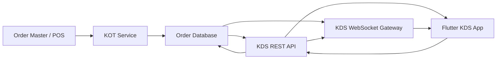
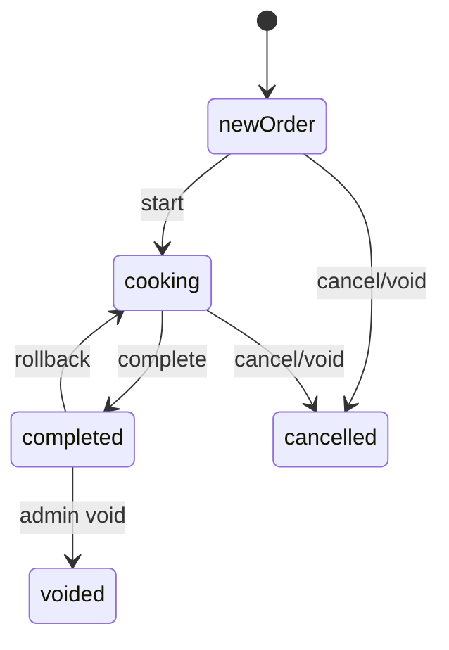

# KDS Backend API and WebSocket Integration Specification

## 1. Purpose

This document defines the backend work required to connect the Order Master Kitchen Display System (KDS) frontend to real restaurant data.

The current Flutter KDS app already has the UI and local state workflow for:

- Staff PIN login.
- Station selection.
- Cooking and Completed order tabs.
- Product quantity sidebar.
- Order cards with modifiers and notes.
- Item done toggles.
- Start, Complete, and Roll back order actions.
- Urgency coloring based on order age.
- Overflow handling when the kitchen screen is full.

The current app still uses mock data. Backend must replace that mock source with fast REST APIs and real-time WebSocket events from Order Master / KOT.

Target delivery: production-ready KDS integration for a restaurant or hotel using Order Master, including multiple kitchen stations.

## 2. Backend Goals

Backend must provide:

1. Low-latency delivery of new and changed KOT orders to KDS screens.
2. Station-specific order filtering.
3. Durable order status transitions: new -> cooking -> completed.
4. Durable rollback from completed -> cooking.
5. Durable item completion state.
6. Staff authentication and action audit trail.
7. Product/category metadata for the sidebar.
8. Multi-kitchen routing support.
9. Reconnect-safe synchronization after network drop or device restart.

The KDS should never depend only on client memory. Every meaningful action must be persisted by backend and broadcast to all relevant KDS clients.

## 3. High-Level Architecture

Recommended architecture:



REST API responsibilities:

- Initial screen load.
- Login/session creation.
- Catalog and station metadata.
- Action commands from KDS.
- Recovery sync after reconnect.

WebSocket responsibilities:

- Push new orders.
- Push order updates.
- Push cancellation/void events.
- Push item completion/status changes.
- Push station/catalog refresh notifications.

## 4. Current Frontend Model

The existing Flutter models are:

```dart
enum OrderStatus { newOrder, cooking, completed }
enum OrderType { dineIn, delivery, takeOut }

class Order {
  String id;
  String displayNumber;
  String stationId;
  DateTime createdAt;
  OrderType type;
  OrderStatus status;
  List<OrderItem> items;
  String? tableNumber;
  String? customerName;
  String? note;
}

class OrderItem {
  String id;
  String productId;
  String nameSnapshot;
  int quantity;
  String? modifierText;
  String? note;
  bool isCompleted;
}

class Station {
  String id;
  String name;
  int displayOrder;
}

class Product {
  String id;
  String name;
  String categoryId;
}

class ProductCategory {
  String id;
  String name;
  int sortOrder;
}
```

Backend JSON should match these fields as closely as possible to keep integration fast.

## 5. Required Data Model

### 5.1 Station

Station represents a kitchen display destination.

Example stations:

- Main Kitchen
- Grill
- Cold Kitchen
- Bar
- Bakery
- Tandoor
- Room Service Kitchen

JSON:

```json
{
  "id": "station_grill",
  "name": "Grill",
  "displayOrder": 10,
  "isActive": true
}
```

Required fields:

- `id`: stable unique station ID.
- `name`: display name.
- `displayOrder`: sort order.
- `isActive`: whether station can receive KDS orders.

### 5.2 Product Category

JSON:

```json
{
  "id": "cat_seafood",
  "name": "SEAFOODS",
  "sortOrder": 20
}
```

Required fields:

- `id`
- `name`
- `sortOrder`

### 5.3 Product

JSON:

```json
{
  "id": "prod_grilled_salmon",
  "name": "Grilled Salmon",
  "categoryId": "cat_seafood",
  "stationIds": ["station_grill"],
  "isActive": true
}
```

Required fields:

- `id`
- `name`
- `categoryId`
- `stationIds`
- `isActive`

Important: `stationIds` is required for multi-kitchen routing. A product may route to one or more stations.

### 5.4 Order

JSON:

```json
{
  "id": "ord_20260803_000123",
  "displayNumber": "356789",
  "kotNumber": "KOT-1829",
  "restaurantId": "rest_001",
  "outletId": "outlet_main",
  "stationId": "station_grill",
  "createdAt": "2026-08-03T08:12:30.000Z",
  "updatedAt": "2026-08-03T08:13:10.000Z",
  "type": "dineIn",
  "status": "newOrder",
  "tableNumber": "05",
  "customerName": "Brownie Jennifer",
  "note": "Serve together",
  "items": []
}
```

Required fields for frontend:

- `id`
- `displayNumber`
- `stationId`
- `createdAt`
- `type`
- `status`
- `items`

Strongly recommended fields:

- `kotNumber`
- `restaurantId`
- `outletId`
- `updatedAt`
- `tableNumber`
- `customerName`
- `note`
- `source`
- `version`

Allowed `type` values:

- `dineIn`
- `delivery`
- `takeOut`

Allowed `status` values:

- `newOrder`
- `cooking`
- `completed`
- `cancelled`
- `voided`

Frontend v1 currently displays `newOrder`, `cooking`, and `completed`. Backend should still support `cancelled` and `voided` so KDS can remove or mark invalid tickets safely.

### 5.5 Order Item

JSON:

```json
{
  "id": "item_001",
  "productId": "prod_grilled_salmon",
  "nameSnapshot": "Grilled Salmon",
  "quantity": 2,
  "modifierText": "No butter, extra lemon",
  "note": "Allergy: dairy",
  "isCompleted": false,
  "stationIds": ["station_grill"],
  "routingStatusByStation": {
    "station_grill": "newOrder"
  }
}
```

Required fields:

- `id`
- `productId`
- `nameSnapshot`
- `quantity`
- `isCompleted`

Strongly recommended fields for hotel/multi-kitchen:

- `stationIds`
- `routingStatusByStation`
- `modifierText`
- `note`
- `course`
- `seatNumber`
- `sortOrder`

Important: `nameSnapshot` must be stored on the order item. If a product name changes later, old KOT tickets must still show the original name.

## 6. Multi-Kitchen Routing Requirement

The current frontend has `stationId` at order level. For a large hotel, backend should support item-level station routing even if frontend v1 initially consumes station-filtered orders.

Recommended backend behavior:

1. POS sends one order with many items.
2. Backend determines each item kitchen destination from product routing rules.
3. Backend creates station-specific KDS projections.
4. KDS station receives only items relevant to that station.

Example:

Original order:

- Table 05
- Steak -> Grill
- Caesar Salad -> Cold Kitchen
- Mojito -> Bar

KDS projections:

- Grill KDS receives same order header with Steak only.
- Cold Kitchen KDS receives same order header with Caesar Salad only.
- Bar KDS receives same order header with Mojito only.

Recommended projection payload:

```json
{
  "id": "ord_20260803_000123:station_grill",
  "sourceOrderId": "ord_20260803_000123",
  "displayNumber": "356789",
  "kotNumber": "KOT-1829",
  "stationId": "station_grill",
  "createdAt": "2026-08-03T08:12:30.000Z",
  "type": "dineIn",
  "status": "newOrder",
  "tableNumber": "05",
  "customerName": "Brownie Jennifer",
  "items": [
    {
      "id": "item_steak:station_grill",
      "sourceItemId": "item_steak",
      "productId": "prod_steak",
      "nameSnapshot": "Ribeye Steak",
      "quantity": 1,
      "modifierText": "Medium rare",
      "note": null,
      "isCompleted": false
    }
  ],
  "version": 3
}
```

This projection model keeps the frontend simple and fast.

## 7. REST API Contract

Base path:

```text
/api/v1/kds
```

All requests should use HTTPS.

All authenticated requests must include:

```http
Authorization: Bearer <access_token>
X-Device-Id: <stable-kds-device-id>
X-Request-Id: <uuid>
```

### 7.1 Login

```http
POST /api/v1/kds/auth/login
```

Request:

```json
{
  "restaurantId": "rest_001",
  "outletId": "outlet_main",
  "staffId": "staff_123",
  "pin": "1234",
  "deviceId": "kds_device_grill_01"
}
```

Response:

```json
{
  "accessToken": "jwt_or_opaque_token",
  "refreshToken": "refresh_token",
  "expiresAt": "2026-08-03T12:00:00.000Z",
  "staff": {
    "id": "staff_123",
    "name": "Maria Cruz",
    "initials": "MC",
    "roles": ["kds_operator"]
  },
  "restaurant": {
    "id": "rest_001",
    "name": "Client Hotel"
  },
  "outlet": {
    "id": "outlet_main",
    "name": "Main Restaurant"
  }
}
```

Errors:

- `401 INVALID_PIN`
- `403 STAFF_NOT_ALLOWED`
- `403 DEVICE_NOT_ALLOWED`
- `423 STAFF_LOCKED`

### 7.2 Refresh Token

```http
POST /api/v1/kds/auth/refresh
```

Request:

```json
{
  "refreshToken": "refresh_token",
  "deviceId": "kds_device_grill_01"
}
```

Response:

```json
{
  "accessToken": "new_access_token",
  "expiresAt": "2026-08-03T12:30:00.000Z"
}
```

### 7.3 Get Bootstrap Data

One efficient bootstrap endpoint is preferred over many small first-load calls.

```http
GET /api/v1/kds/bootstrap?restaurantId=rest_001&outletId=outlet_main
```

Response:

```json
{
  "serverTime": "2026-08-03T08:20:00.000Z",
  "restaurant": {
    "id": "rest_001",
    "name": "Client Hotel"
  },
  "outlet": {
    "id": "outlet_main",
    "name": "Main Restaurant"
  },
  "stations": [
    {
      "id": "station_grill",
      "name": "Grill",
      "displayOrder": 10,
      "isActive": true
    }
  ],
  "categories": [
    {
      "id": "cat_seafood",
      "name": "SEAFOODS",
      "sortOrder": 20
    }
  ],
  "products": [
    {
      "id": "prod_grilled_salmon",
      "name": "Grilled Salmon",
      "categoryId": "cat_seafood",
      "stationIds": ["station_grill"],
      "isActive": true
    }
  ],
  "websocket": {
    "url": "wss://api.example.com/api/v1/kds/ws",
    "heartbeatIntervalSeconds": 20,
    "reconnectMinDelayMs": 500,
    "reconnectMaxDelayMs": 10000
  }
}
```

### 7.4 List Active Orders For Station

```http
GET /api/v1/kds/orders?restaurantId=rest_001&outletId=outlet_main&stationId=station_grill&status=active
```

`status=active` means all non-completed, non-cancelled, non-voided orders.

Response:

```json
{
  "serverTime": "2026-08-03T08:21:00.000Z",
  "stationId": "station_grill",
  "orders": [
    {
      "id": "ord_20260803_000123:station_grill",
      "sourceOrderId": "ord_20260803_000123",
      "displayNumber": "356789",
      "kotNumber": "KOT-1829",
      "stationId": "station_grill",
      "createdAt": "2026-08-03T08:12:30.000Z",
      "updatedAt": "2026-08-03T08:13:10.000Z",
      "type": "dineIn",
      "status": "newOrder",
      "tableNumber": "05",
      "customerName": "Brownie Jennifer",
      "note": "Serve together",
      "version": 3,
      "items": [
        {
          "id": "item_001:station_grill",
          "sourceItemId": "item_001",
          "productId": "prod_grilled_salmon",
          "nameSnapshot": "Grilled Salmon",
          "quantity": 2,
          "modifierText": "No butter, extra lemon",
          "note": "Allergy: dairy",
          "isCompleted": false,
          "sortOrder": 1
        }
      ]
    }
  ],
  "syncCursor": "cursor_000001"
}
```

Sorting:

- Oldest active orders first.
- Within one order, item sort should follow KOT/POS order.

Performance target:

- P95 response under 300 ms for 100 active station orders.
- Payload should be gzip/br compressed.

### 7.5 List Completed Orders

```http
GET /api/v1/kds/orders?restaurantId=rest_001&outletId=outlet_main&stationId=station_grill&status=completed&limit=50
```

Response shape is same as active order list.

Backend should default completed order list to recent orders only, for example last 2 hours or last 50 records.

### 7.6 Start Order

```http
POST /api/v1/kds/orders/{orderId}/start
```

Request:

```json
{
  "stationId": "station_grill",
  "staffId": "staff_123",
  "deviceId": "kds_device_grill_01",
  "idempotencyKey": "4d183100-2a19-4bb6-81b9-d5a0c6af0b2b",
  "expectedVersion": 3
}
```

Response:

```json
{
  "order": {
    "id": "ord_20260803_000123:station_grill",
    "status": "cooking",
    "version": 4,
    "updatedAt": "2026-08-03T08:22:00.000Z"
  }
}
```

Rules:

- Allowed only from `newOrder`.
- If already `cooking`, return 200 with current order and `alreadyApplied: true`.
- If completed/cancelled/voided, return 409.

### 7.7 Complete Order

```http
POST /api/v1/kds/orders/{orderId}/complete
```

Request:

```json
{
  "stationId": "station_grill",
  "staffId": "staff_123",
  "deviceId": "kds_device_grill_01",
  "idempotencyKey": "9c7f7283-4278-437d-9809-54416b7a0d94",
  "expectedVersion": 4
}
```

Response:

```json
{
  "order": {
    "id": "ord_20260803_000123:station_grill",
    "status": "completed",
    "version": 5,
    "completedAt": "2026-08-03T08:27:00.000Z"
  }
}
```

Rules:

- Allowed only from `cooking`.
- Completing all items should not auto-complete the order. The explicit Complete action must be used.
- Completed order should move from Cooking tab to Completed tab on all connected clients.

### 7.8 Roll Back Completed Order

```http
POST /api/v1/kds/orders/{orderId}/rollback
```

Request:

```json
{
  "stationId": "station_grill",
  "staffId": "staff_123",
  "deviceId": "kds_device_grill_01",
  "reason": "Completed by mistake",
  "idempotencyKey": "3f0af7cf-1001-4617-a268-db89836f7b42",
  "expectedVersion": 5
}
```

Response:

```json
{
  "order": {
    "id": "ord_20260803_000123:station_grill",
    "status": "cooking",
    "version": 6,
    "updatedAt": "2026-08-03T08:28:00.000Z"
  }
}
```

Rules:

- Allowed only from `completed`.
- Item completion flags must be preserved.
- Must be audited.
- Must broadcast an order update so the order returns to Cooking tab.

### 7.9 Toggle Item Completion

Recommended explicit endpoint:

```http
PATCH /api/v1/kds/orders/{orderId}/items/{itemId}
```

Request:

```json
{
  "stationId": "station_grill",
  "isCompleted": true,
  "staffId": "staff_123",
  "deviceId": "kds_device_grill_01",
  "idempotencyKey": "d3d9a99b-f8dd-4d41-8be8-1406b2c8ff01",
  "expectedVersion": 6
}
```

Response:

```json
{
  "item": {
    "id": "item_001:station_grill",
    "isCompleted": true
  },
  "order": {
    "id": "ord_20260803_000123:station_grill",
    "version": 7,
    "updatedAt": "2026-08-03T08:29:00.000Z"
  }
}
```

Rules:

- Allowed only when order status is `cooking`.
- No-op or 409 when order is `newOrder`, `completed`, `cancelled`, or `voided`.
- Must not auto-complete the order when all items are completed.

### 7.10 Sync Since Cursor

Used after reconnect or when websocket events may have been missed.

```http
GET /api/v1/kds/sync?restaurantId=rest_001&outletId=outlet_main&stationId=station_grill&cursor=cursor_000001
```

Response:

```json
{
  "serverTime": "2026-08-03T08:31:00.000Z",
  "events": [
    {
      "eventId": "evt_001",
      "type": "order.updated",
      "occurredAt": "2026-08-03T08:29:00.000Z",
      "stationId": "station_grill",
      "order": {}
    }
  ],
  "nextCursor": "cursor_000010",
  "requiresFullReload": false
}
```

If backend cannot replay from the cursor, return:

```json
{
  "events": [],
  "nextCursor": "cursor_000100",
  "requiresFullReload": true
}
```

Then frontend will call list active/completed orders again.

## 8. WebSocket Contract

Endpoint:

```text
wss://api.example.com/api/v1/kds/ws
```

Connection query:

```text
?restaurantId=rest_001&outletId=outlet_main&stationId=station_grill&deviceId=kds_device_grill_01
```

Authentication:

```http
Authorization: Bearer <access_token>
```

### 8.1 Client Hello

Client sends after connect:

```json
{
  "type": "client.hello",
  "messageId": "msg_001",
  "stationId": "station_grill",
  "lastCursor": "cursor_000001",
  "appVersion": "1.0.0",
  "deviceId": "kds_device_grill_01"
}
```

Server response:

```json
{
  "type": "server.hello",
  "messageId": "msg_001",
  "serverTime": "2026-08-03T08:32:00.000Z",
  "connectionId": "conn_abc",
  "heartbeatIntervalSeconds": 20,
  "syncRequired": false,
  "cursor": "cursor_000001"
}
```

### 8.2 Heartbeat

Server sends:

```json
{
  "type": "ping",
  "messageId": "ping_001",
  "serverTime": "2026-08-03T08:32:20.000Z"
}
```

Client responds:

```json
{
  "type": "pong",
  "messageId": "ping_001",
  "clientTime": "2026-08-03T08:32:20.100Z"
}
```

### 8.3 Event Envelope

All server events should use this envelope:

```json
{
  "type": "order.updated",
  "eventId": "evt_000123",
  "cursor": "cursor_000123",
  "restaurantId": "rest_001",
  "outletId": "outlet_main",
  "stationId": "station_grill",
  "occurredAt": "2026-08-03T08:33:00.000Z",
  "payload": {}
}
```

Required:

- `type`
- `eventId`
- `cursor`
- `restaurantId`
- `outletId`
- `stationId`
- `occurredAt`
- `payload`

### 8.4 Event Types

#### order.created

Sent when a new KOT/order projection should appear on a station.

```json
{
  "type": "order.created",
  "eventId": "evt_001",
  "cursor": "cursor_001",
  "stationId": "station_grill",
  "occurredAt": "2026-08-03T08:33:00.000Z",
  "payload": {
    "order": {}
  }
}
```

Frontend behavior:

- Add order if not present.
- Sort by `createdAt`.
- Repack board.

#### order.updated

Sent when header, items, notes, status, or version changes.

```json
{
  "type": "order.updated",
  "eventId": "evt_002",
  "cursor": "cursor_002",
  "stationId": "station_grill",
  "occurredAt": "2026-08-03T08:34:00.000Z",
  "payload": {
    "order": {}
  }
}
```

Frontend behavior:

- Replace matching order by `id`.
- If status moves to completed, Cooking tab loses the order and Completed tab gains it.

#### order.removed

Sent when order should disappear from the station because it was cancelled, voided, transferred, or rerouted.

```json
{
  "type": "order.removed",
  "eventId": "evt_003",
  "cursor": "cursor_003",
  "stationId": "station_grill",
  "occurredAt": "2026-08-03T08:35:00.000Z",
  "payload": {
    "orderId": "ord_20260803_000123:station_grill",
    "sourceOrderId": "ord_20260803_000123",
    "reason": "cancelled"
  }
}
```

Allowed reasons:

- `cancelled`
- `voided`
- `rerouted`
- `merged`
- `closed`

#### item.updated

Can be used for small item updates. If implementation speed matters, backend may send full `order.updated` instead.

```json
{
  "type": "item.updated",
  "eventId": "evt_004",
  "cursor": "cursor_004",
  "stationId": "station_grill",
  "occurredAt": "2026-08-03T08:36:00.000Z",
  "payload": {
    "orderId": "ord_20260803_000123:station_grill",
    "item": {
      "id": "item_001:station_grill",
      "isCompleted": true
    },
    "orderVersion": 7
  }
}
```

#### catalog.updated

Sent when products, categories, or routing rules changed.

```json
{
  "type": "catalog.updated",
  "eventId": "evt_005",
  "cursor": "cursor_005",
  "stationId": "station_grill",
  "occurredAt": "2026-08-03T08:37:00.000Z",
  "payload": {
    "requiresBootstrapReload": true
  }
}
```

#### station.updated

Sent when station name, active state, or routing changed.

```json
{
  "type": "station.updated",
  "eventId": "evt_006",
  "cursor": "cursor_006",
  "stationId": "station_grill",
  "occurredAt": "2026-08-03T08:38:00.000Z",
  "payload": {
    "station": {
      "id": "station_grill",
      "name": "Grill",
      "displayOrder": 10,
      "isActive": true
    }
  }
}
```

### 8.5 Reconnect Rules

Client behavior:

1. Connect WebSocket after bootstrap.
2. Store latest `cursor`.
3. If disconnected, reconnect with exponential backoff.
4. Send `client.hello` with `lastCursor`.
5. If `syncRequired=true`, call `/sync`.
6. If sync says `requiresFullReload=true`, reload active/completed orders.

Backend behavior:

- Keep replayable event history for at least 4 hours.
- Cursor must be monotonic per restaurant/outlet/station stream.
- Events must be idempotent. Replaying the same event should not duplicate orders.

## 9. Status Transition Rules

Allowed state machine:



Rules:

- `newOrder -> cooking`: allowed from KDS.
- `cooking -> completed`: allowed from KDS.
- `completed -> cooking`: allowed from KDS rollback.
- `newOrder/cooking -> cancelled`: allowed from POS/Order Master.
- `completed -> voided`: admin/backend only.
- KDS item completion only allowed while order is `cooking`.

Invalid transitions should return HTTP 409 with the current order.

## 10. Idempotency and Versioning

Every KDS command must include:

- `idempotencyKey`
- `expectedVersion`
- `deviceId`
- `staffId`

Backend must:

- Deduplicate repeated requests with same idempotency key.
- Return the original success response for duplicate retries.
- Detect stale updates using `expectedVersion`.
- Return 409 when the frontend version is stale.

409 response:

```json
{
  "error": {
    "code": "VERSION_CONFLICT",
    "message": "Order was updated by another device.",
    "currentVersion": 8
  },
  "order": {}
}
```

## 11. Error Response Format

All API errors should use:

```json
{
  "error": {
    "code": "INVALID_TRANSITION",
    "message": "Only cooking orders can be completed.",
    "details": {
      "currentStatus": "newOrder"
    }
  }
}
```

Common codes:

- `UNAUTHORIZED`
- `FORBIDDEN`
- `INVALID_PIN`
- `DEVICE_NOT_ALLOWED`
- `STATION_NOT_FOUND`
- `ORDER_NOT_FOUND`
- `ITEM_NOT_FOUND`
- `INVALID_TRANSITION`
- `VERSION_CONFLICT`
- `IDEMPOTENCY_CONFLICT`
- `VALIDATION_ERROR`
- `RATE_LIMITED`
- `SERVER_ERROR`

## 12. Performance Requirements

Kitchen display must feel instant.

Targets:

- WebSocket event delivery: P95 under 500 ms from backend commit.
- Start/complete/rollback API: P95 under 300 ms.
- Initial bootstrap: P95 under 800 ms.
- Active order list: P95 under 300 ms for 100 active station orders.
- Sync after reconnect: P95 under 500 ms for 200 events.
- WebSocket reconnect: first retry after 500 ms, max 10 seconds.

Payload guidelines:

- Prefer one bootstrap endpoint.
- Use full order payload for `order.created` and `order.updated` during v1 for simplicity.
- Use gzip or Brotli compression for REST.
- Avoid sending all stations' orders to one KDS device.
- Send only station-relevant order projections.

Database/index recommendations:

- Index `restaurantId`, `outletId`, `stationId`, `status`, `createdAt`.
- Index `sourceOrderId`.
- Index `updatedAt` for sync.
- Keep append-only event log for websocket replay.
- Keep idempotency table keyed by `restaurantId + deviceId + idempotencyKey`.

## 13. Security and Audit

Authentication:

- Staff PIN must be validated by backend.
- Tokens should be short-lived.
- Refresh token should be tied to `deviceId`.
- Device registration or allow-list is recommended for hotel kitchen screens.

Authorization:

- Staff must have permission to operate KDS.
- Device may be restricted to specific station(s).
- Backend should reject actions for stations the device/staff cannot access.

Audit every action:

```json
{
  "actionId": "act_001",
  "restaurantId": "rest_001",
  "outletId": "outlet_main",
  "stationId": "station_grill",
  "orderId": "ord_20260803_000123:station_grill",
  "sourceOrderId": "ord_20260803_000123",
  "itemId": null,
  "action": "complete_order",
  "fromStatus": "cooking",
  "toStatus": "completed",
  "staffId": "staff_123",
  "deviceId": "kds_device_grill_01",
  "occurredAt": "2026-08-03T08:27:00.000Z"
}
```

Actions to audit:

- Login success/failure.
- Start order.
- Complete order.
- Rollback order.
- Toggle item completion.
- Cancel/void/reroute received from POS.
- Device connection/disconnection, if feasible.

## 14. Frontend Mapping Notes

The Flutter app can replace the mock service with a real KDS API service if backend returns these minimum fields:

Order:

- `id`
- `displayNumber`
- `stationId`
- `createdAt`
- `type`
- `status`
- `items`
- `tableNumber`
- `customerName`
- `note`

Order item:

- `id`
- `productId`
- `nameSnapshot`
- `quantity`
- `modifierText`
- `note`
- `isCompleted`

Station:

- `id`
- `name`
- `displayOrder`

Product:

- `id`
- `name`
- `categoryId`

Category:

- `id`
- `name`
- `sortOrder`

Important frontend behavior:

- Cooking tab shows all orders where `status != completed`.
- Completed tab shows orders where `status == completed`.
- Sidebar quantities include only active cooking work.
- Urgency is calculated locally from `createdAt`.
- Double-tap item done should only work for cooking orders.
- Completing all items does not automatically complete an order.

## 15. Minimum Viable Backend For 1-Week Delivery

If delivery is urgent, implement in this order:

### Day 1: Data Contract and Bootstrap

- Finalize JSON names exactly.
- Implement login with real staff PIN or temporary secured staff auth.
- Implement `/bootstrap`.
- Implement station/product/category APIs through bootstrap.

### Day 2: Active Orders API

- Implement station-filtered active order list.
- Convert Order Master/KOT data to KDS order projection.
- Include modifiers, notes, table/customer/order type.

### Day 3: KDS Actions

- Implement start, complete, rollback.
- Implement item completion update.
- Add idempotency and version checks.
- Add audit records.

### Day 4: WebSocket

- Implement station-specific WebSocket channel.
- Broadcast `order.created`, `order.updated`, and `order.removed`.
- Add heartbeat and reconnect support.

### Day 5: Sync and Edge Cases

- Implement `/sync`.
- Handle cancelled/voided orders.
- Handle modified KOT orders after they are visible on KDS.
- Handle station rerouting.

### Day 6: Load and Device Testing

- Test with real restaurant menu.
- Test 100+ active orders.
- Test 5+ connected KDS devices.
- Test network drop/reconnect.
- Test duplicate taps and idempotency.

### Day 7: Client Pilot

- Configure hotel stations.
- Configure item/product routing.
- Run live parallel test with current KOT print system.
- Keep KOT print fallback enabled during pilot.

## 16. Non-Negotiable Acceptance Criteria

Backend is ready for client pilot only when:

- New KOT appears on correct KDS station within 2 seconds.
- Modified KOT updates visible KDS cards without refresh.
- Cancelled/voided KOT disappears or clearly updates on KDS.
- Start/Complete/Rollback persist and survive app refresh.
- Item done state persists and broadcasts to other devices.
- Reconnect recovers missed events without duplicate orders.
- Multiple kitchen stations receive only relevant items.
- Completed tab shows recent completed station orders.
- All KDS actions are audited with staff and device.
- Release build can point to production/staging URLs by configuration.

## 17. Open Decisions Needed From Product/Backend

These decisions must be confirmed before implementation:

1. Should KDS display whole orders per station, or station-specific item projections?
2. What are the exact kitchen stations for the client hotel?
3. Are item routing rules already present in Order Master, or must backend add them?
4. Should a completed order remain visible for a fixed time or only in Completed tab?
5. Should rollback require a reason or manager permission?
6. Should KDS support order cancellation display, sound, or visual alert?
7. What is the deployment target: web browser, Android tablet, Windows terminal, or all?
8. Does the current KOT print system remain active during pilot?

## 18. Recommended Backend Implementation Strategy

For speed and reliability:

- Create a KDS projection layer instead of forcing frontend to understand full POS order complexity.
- Store current projection state per `sourceOrderId + stationId`.
- Store an append-only event log for every KDS-visible change.
- Make REST list endpoints read from projection tables.
- Make WebSocket events publish from the same committed projection changes.
- Keep frontend payload stable even if internal POS/KOT schema changes.

Suggested tables or collections:

- `kds_stations`
- `kds_product_routing`
- `kds_order_projections`
- `kds_order_projection_items`
- `kds_events`
- `kds_action_audit`
- `kds_idempotency_keys`
- `kds_devices`

This keeps v1 fast while leaving room for advanced hotel routing later.

